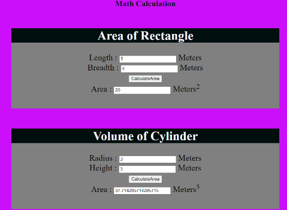

# AngularCalculation

# Web Page for Mathematical Calculations using Angular

## AIM:
To design a dynamic website to perform mathematical calculations using Angular Framwork

## DESIGN STEPS:
## Step 1:
Requirement collection.

## Step 2:
Creating the layout using HTML and CSS in component.html file

## Step 3:
Write typescript to perform the calculations.

## Step 4:
Validate the layout in various browsers.

## Step 5:
Validate the HTML code.

## Step 6:
Publish the website in the given URL.

## PROGRAM :
## Rectangle:
## Rectangle.component.html:
~~~

    

    <h2>Area of Rectangle</h2>
    Length : <input type="text"[(ngModel)]='length'>  Meters 
    Breadth : <input type="text"[(ngModel)]='breadth'>  Meters 
    <input type="button" (click)="onCalculate()" value="CalculateArea"> 
    Area : <input type="text" [value]="area">  Meters2 

~~~

## Rectangle.component.ts:
~~~
import { Component } from "@angular/core";

@Component({
    selector:'Rectangle-Area',
    templateUrl:'./rectangle.component.html'
})
export class RectangleComponent{
    length:number;
    breadth:number;
    area:number;
    constructor(){
        this.length=0;
        this.breadth=0;
        this.area=0;

    }
    onCalculate()
    {
            this.area = this.length*this.breadth
    }
}

~~~

## cylinder.component.html:
~~~

    <h2>Volume of Cylinder</h2>
    Radius : <input type="text"[(ngModel)]='Radius'>  Meters 
    Height : <input type="text"[(ngModel)]='Height'>  Meters 
    <input type="button" (click)="onCalculate()" value="CalculateArea"> 
    Area : <input type="text" [value]="Area">  Meters3 

~~~

## cylinder.component.ts:
~~~
import { Component } from "@angular/core";

@Component({
    selector:'Volume-cylinder',
    templateUrl:'./cylinder.component.html'
})
export class CylinderComponent{
    Radius:number;
    Height:number;
    Area:number;
    constructor(){
        this.Radius=0;
        this.Height=0;
        this.Area=0;

    }
    onCalculate()
    {
            this.Area =22/7*this.Radius**2*this.Height
    }
}

~~~

## App

~~~
h2{
    text-align: center;
    color: rgb(17, 14, 39);
    margin-top: 10px;

}
.container {
    width: 800px;
    margin-left: auto;
    margin-right: auto;
  }
  .backgd{
    background-color: rgb(203, 15, 250) ;
}
  .footer{
      text-align: center;
      font-size: 30px;
      color: rgb(245, 245, 248);
      background-color: rgb(8,8,8);
      margin-top: 10px;
  }

~~~
## App.component.html:
~~~

    <h2>MATH CALCULATION</h2>
    

        
<Rectangle-Area>

</Rectangle-Area>

<Cylinder-Vol>
  
</Cylinder-Vol>

Developed by: Easwar

    

~~~

## App.module.ts:
~~~
import { NgModule } from '@angular/core';
import { FormsModule } from '@angular/forms';
import { BrowserModule } from '@angular/platform-browser';

import { AppComponent } from './app.component';
import { CylinderComponent } from './cylinder/cylinder.component';
import { RectangleComponent } from './rectangle/rectangle.component';

@NgModule({
  declarations: [
    AppComponent,RectangleComponent,CylinderComponent
  ],
  imports: [
    BrowserModule,FormsModule
  ],
  providers: [],
  bootstrap: [AppComponent]
})
export class AppModule { }

~~~

## OUTPUT:

## Result:
